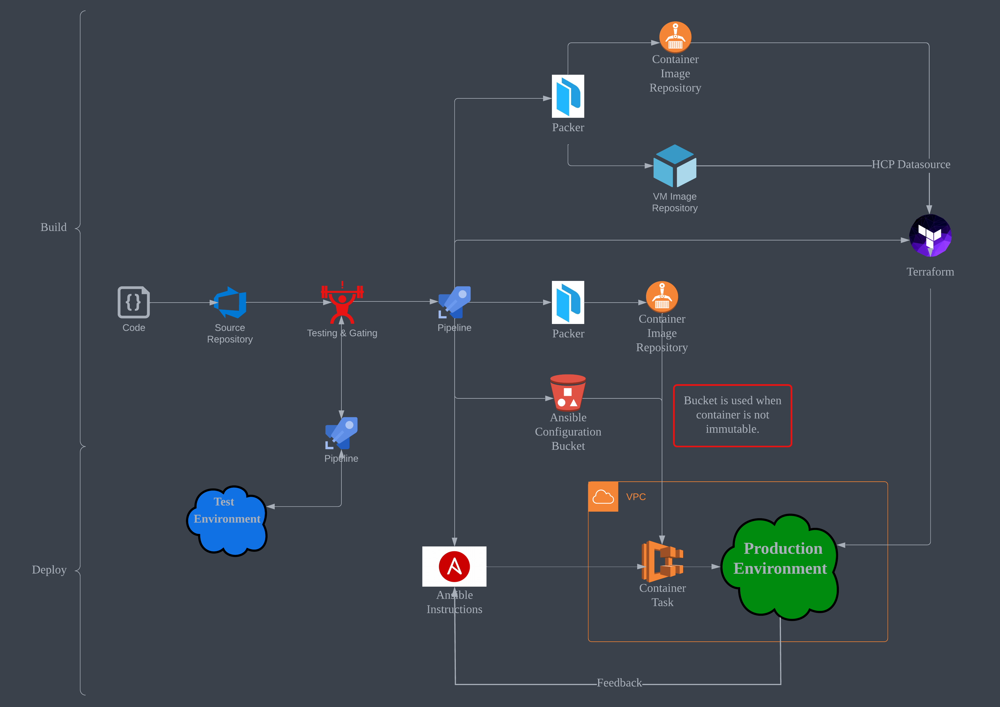

# AWS Infrastructure CI/CD Pipeline



## Concept

1. Terraform builds an immutable Ansible container environment.

2. Packer pushes Ansible image to the repository.

3. Terraform builds the rest of the infrastructure.

4. The pipeline executes the Ansible task on the infrastructure.

## Testing & Gating

1. Only necessary resources are built during Pull Request. The rest are plannings and dry-runs.

2. All steps require approvals to proceed during Pull Request and merge.

## Contribute

0. Quick way: use an IDE with Git integrations instead (such as Visual Studio Code).

1. Clone the *main* branch.

    ```bash
    git clone https://github.com/fer1035/terraform-pipeline-aws.git
    ```

2. Create your feature branch from *main*.

    ```bash
    git checkout -b my-branch
    ```

3. Make your changes.

4. Commit and push your feature branch to origin.

    ```bash
    git commit -m "Updating changes in my-branch."
    git push --set-upstream origin my-branch
    ```

5. Create a Pull Request from your feature branch to *main*.

    - Pull Requests will require all checks to pass before merging.

    - Both of the existing pipelines now require approvals to execute Pull Requests and merges to the **main** branch for the specified environment. You can target a different environment (or none at all), but you will need to specify your own variables as the existing ones are specific to the current environment.
